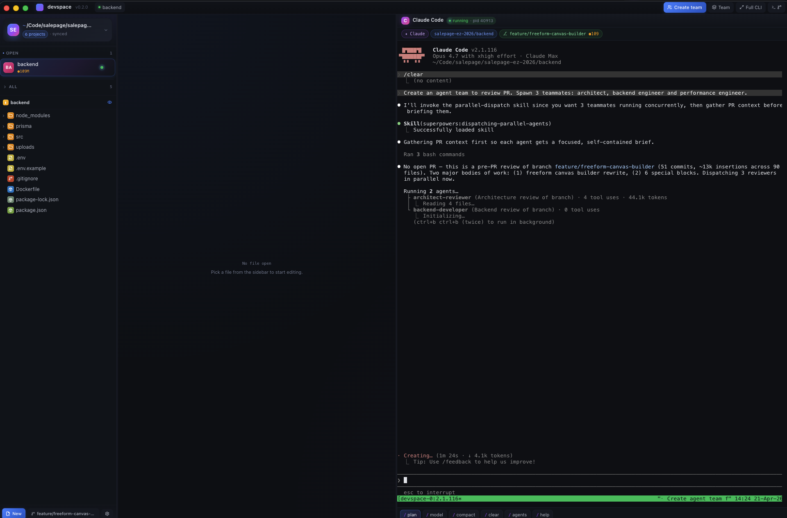
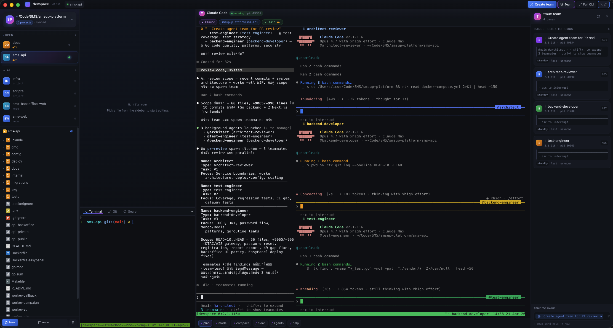
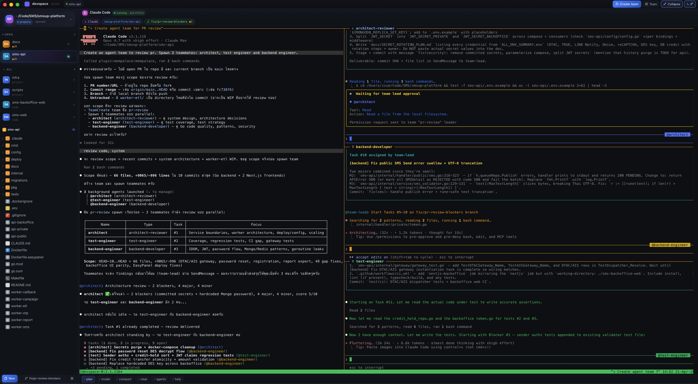

# DevSpace

> One-window MacBook dev workspace with **Claude Code CLI** at the core.

DevSpace is a native macOS Electron app that wraps your daily coding loop — file
tree, code editor, terminal, git, and **Claude Code agent teams** — into a
single window. It uses `tmux` under the hood so every agent and shell pane
survives app restarts, panel remounts, and accidental Cmd+Q.

<p align="center">
  <a href="https://github.com/icueth/devspace-ide-for-claude-code/releases/latest/download/devspace-0.3.14-arm64.dmg">
    
  </a>
  &nbsp;
  <a href="https://github.com/icueth/devspace-ide-for-claude-code/releases/latest">
    
  </a>
</p>



---

## Highlights

- **Claude Code CLI dock** — first-class panel for `claude`, with persistent
  tmux-backed sessions per project.
- **Agent Team mode** — run a multi-agent crew (lead, devs, reviewer, qa) side
  by side, each in its own pane, color-coded and status-aware.
- **CodeMirror 6 editor** — tabs, multi-language highlighting, diff view,
  markdown / image / pdf preview, go-to-line, quick open (`⌘P`).
- **Project-aware workspace** — pick a parent folder, DevSpace auto-detects
  every project inside (git, package.json, go.mod, …).
- **Integrated git** — branch picker, status panel, staged/unstaged diff right
  next to your editor.
- **Search-in-project** (`⌘⇧F`), command palette, prompt dialog, account
  settings.
- **Resilient PTY** — terminal panes are tmux sessions, so `claude` keeps
  running even if you close the window.

| | |
|---|---|
|  |  |

---

## Requirements

DevSpace is a thin shell around the Claude Code CLI. Before you launch the
app, install:

| Tool | Why |
|---|---|
| [**Claude Code CLI**](https://docs.anthropic.com/claude-code) | The `claude` binary that powers every agent pane. Without it, panes fall back to a plain shell with a hint. |
| [**tmux**](https://github.com/tmux/tmux) | Backs every CLI pane so sessions survive app restarts and Team mode can run multi-pane agent crews. Highly recommended — without tmux you lose persistence. |

### Install on macOS

```bash
# Claude Code CLI (one of):
npm install -g @anthropic-ai/claude-code
# or
brew install anthropic/claude/claude

# tmux
brew install tmux
```

Verify both are on your `PATH`:

```bash
which claude tmux
claude --version
tmux -V
```

DevSpace also requires **macOS 12+** (Monterey or later).

---

## Install

1. Download the latest **`.dmg`** from
   [Releases](https://github.com/icueth/devspace-ide-for-claude-code/releases/latest).
2. Open the DMG and drag **DevSpace** into `/Applications`.
3. The app is **not notarized** (yet). The first time you launch it, macOS may
   block it — open **System Settings → Privacy & Security** and click
   **Open Anyway**, or run:

   ```bash
   xattr -dr com.apple.quarantine /Applications/devspace.app
   ```

> Releases ship the **Apple Silicon (`arm64`) DMG only**. Intel Macs are not
> supported in the current builds.

---

## Getting started

1. Make sure `claude` and `tmux` are installed (see above).
2. Launch **DevSpace**.
3. On the welcome screen, click **Open folder…** and pick a parent folder
   that contains one or more projects.
4. Pick a project from the sidebar — the editor, terminal, and Claude CLI
   dock all wire up to that project's directory.
5. Hit the Claude pane and start chatting. Press **`⌘⇧T`** to cycle into
   **Team mode** for a multi-agent crew.

### Keyboard shortcuts

| Shortcut | Action |
|---|---|
| `⌘P` | Quick open file |
| `⌘⇧F` | Search in project |
| `⌘⇧T` | Team mode cycle |
| `⌘⇧L` | Send selection to Claude |
| `⌘S` | Save file |
| `⌘W` | Close tab |
| `⌘G` | Go to line |
| `⌘+` / `⌘−` | Editor zoom |

---

## Build from source

```bash
# Clone
git clone git@github.com:icueth/devspace-ide-for-claude-code.git
cd devspace-ide-for-claude-code

# Install deps (uses pnpm)
pnpm install

# Dev mode — hot reload Electron + renderer
pnpm dev

# Type-check
pnpm typecheck

# Build production bundle (no installer)
pnpm build

# Build a signed-less Apple Silicon DMG into ./release
pnpm dist:mac:arm64
```

### Stack

- **Electron 40** + **electron-vite** + **electron-builder**
- **React 19** + **TypeScript 5.9** + **TailwindCSS 3** + **Radix UI**
- **CodeMirror 6** for the editor, **xterm.js** + **node-pty** for terminals
- **simple-git**, **chokidar**, **zustand**

---

## Project layout

```
src/
├── main/          # Electron main process — IPC, services, PTY pool, tmux
│   ├── ipc/       # Channel handlers (fs, git, pty, tmux, settings, …)
│   ├── services/  # ClaudeCliLauncher, FileWatcher, GitStatus, Workspace
│   └── utils/     # atomic write, interactive shell env resolution
├── preload/       # Context bridge between main + renderer
├── renderer/      # React app
│   ├── components/  # Editor, Sidebar, Bottom, Agents, Dock, Settings, …
│   ├── state/       # zustand stores
│   └── lib/         # api wrapper around the IPC bridge
└── shared/        # Shared types, IPC channel names, logger
```

---

## License

MIT · © icueth
