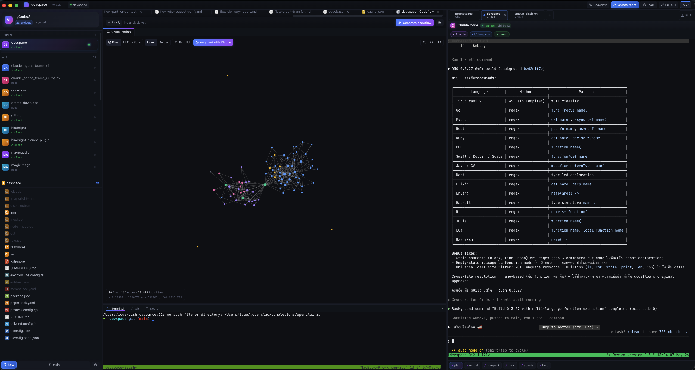
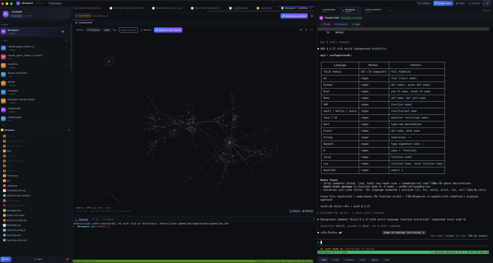
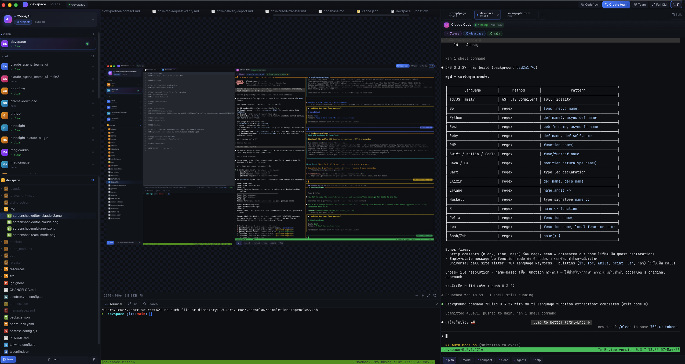
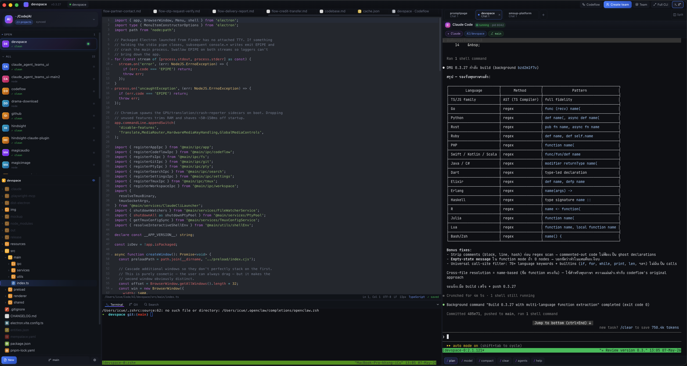
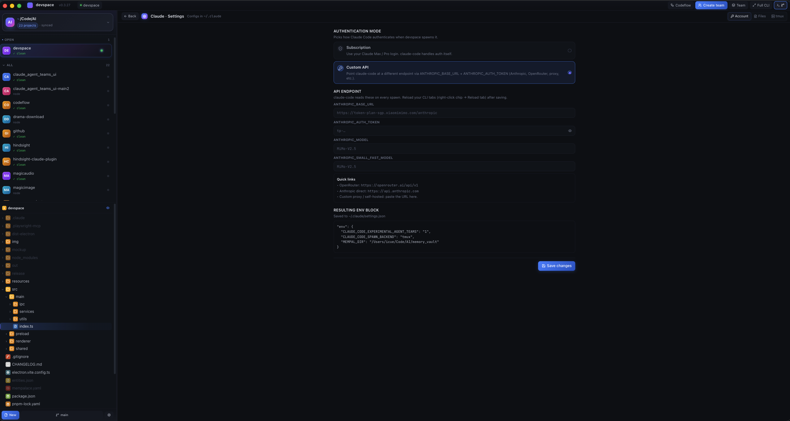
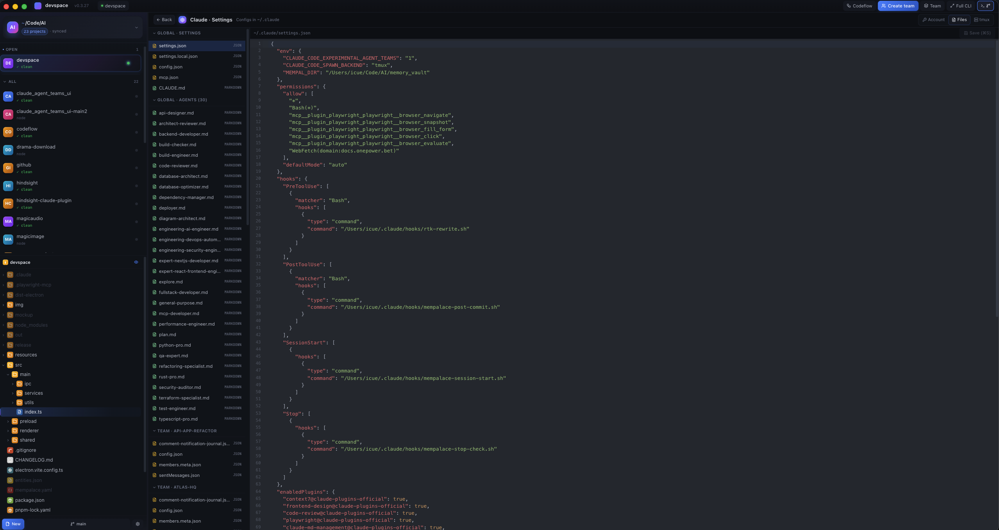
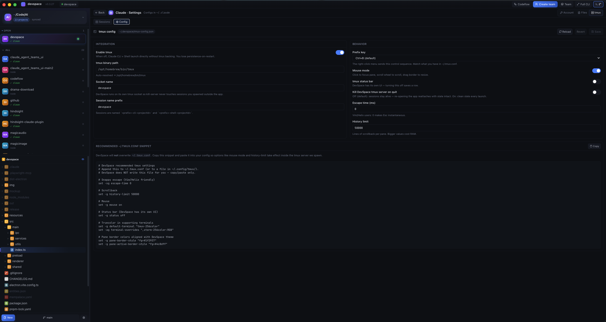
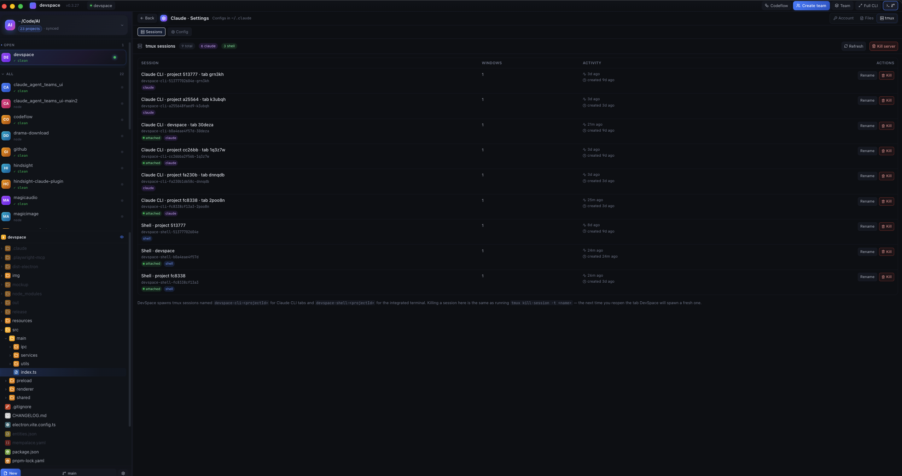

# DevSpace

> One-window MacBook dev workspace with **Claude Code CLI** at the core.

DevSpace is a native macOS Electron app that wraps your daily coding loop —
file tree, code editor, terminal, git, **Claude Code agent teams**, and a
live **codebase visualization** powered by Claude — into a single window.
It uses `tmux` under the hood so every agent and shell pane survives app
restarts, panel remounts, and accidental Cmd+Q.

<p align="center">
  <a href="https://github.com/icueth/devspace-ide-for-claude-code/releases/latest/download/devspace-0.3.31-arm64.dmg">
    
  </a>
  &nbsp;
  <a href="https://github.com/icueth/devspace-ide-for-claude-code/releases/latest">
    
  </a>
  &nbsp;
  <a href="https://buy.stripe.com/14A28sbLa5mJ8SM5qY2VG01">
    
  </a>
</p>



---

## Highlights

- **Codeflow tab** — a live D3 force-directed dependency graph of your
  project, with a *Files* mode (one node per file, edges = imports) and a
  *Functions* mode (one node per function/method, edges = cross-file
  calls). Color by detected layer (UI / API / Service / Util / …) or by
  parent file. Click any node for blast-radius and a callers/callees
  side panel.
- **Augment with Claude** — on top of the static graph, ask Claude to
  surface SOFT edges name-resolution can't see: callbacks passed as
  args, plugin/handler registries dispatched by string, interface
  method dispatch, pub/sub event coupling. Soft edges render as
  dashed kind-colored overlays so the static spine stays readable.
- **Generate codeflow** — Claude Code headless writes
  `.claude/codeflow/codebase.md` (architecture overview) and per-feature
  `flow-*.md` traces directly into the project. A
  `codeflow-context` skill auto-installs at
  `.claude/skills/` so any subsequent `claude` session in the project
  loads the architecture knowledge automatically.
- **Multi-language support** — file-level graph parses TS/JS via the
  TypeScript Compiler API and falls back to regex for Python, Go,
  Rust, Ruby, PHP, Swift, Kotlin, Scala, Java, C#, Dart, Elixir,
  Erlang, Haskell, R, Julia, Lua, and shell. Imports resolve through
  `tsconfig.json` `paths` and `vite.config.*` `resolve.alias`. Walks
  honor your `.gitignore` via `git ls-files` so `vendor/`, `.next/`,
  `node_modules/`, generated protobuf, etc. stay out automatically.
- **Claude Code CLI dock** — first-class panel for `claude`, with
  persistent tmux-backed sessions per project. Multiple chat tabs per
  project, history survives quit-and-reopen.
- **Agent Team mode** — run a multi-agent crew (lead, devs, reviewer,
  qa) side by side, each in its own pane, color-coded and
  status-aware. Cycle into Team mode with `⌘⇧T`.
- **CodeMirror 6 editor** — tabs with split-pane support, multi-language
  highlighting, diff view, markdown / image / pdf preview, go-to-line
  (`⌘G`), quick open (`⌘P`), new file (`⌘N`).
- **AI inline autocomplete** — Cursor-style ghost-text suggestions while
  you type. Pause on a line, the editor sends prefix + suffix +
  filename to your configured LLM and renders the reply as faded
  italic ghost text after the cursor. **Tab** accepts; **Esc**
  dismisses; any other keystroke invalidates. Off by default; opt in
  via Settings → LLM. Race-safe via a sequence counter, debounce
  configurable per-endpoint.
- **`⌘K` — edit selection with AI** — select code, press ⌘K, type an
  instruction (*"convert to async/await"*, *"extract a helper"*,
  *"add error handling"*). The LLM gets your selection plus ~6KB of
  surrounding file context as a style hint and returns a drop-in
  replacement, rendered as a side-by-side diff. **Enter** accepts,
  **Esc** cancels.
- **Generic LLM connection** — separate from the Claude Code CLI
  dock. Settings → LLM tab configures any **OpenAI-compatible**
  endpoint (OpenAI proper, Azure, OpenRouter, Together.ai, Ollama
  `/v1`, LM Studio, vLLM, llama.cpp, Xiaomi MiMo, …) or **Anthropic**'s
  `/v1/messages`. Test button does a 1-token round-trip with latency +
  model-echo + response sample. Auto-strips `<think>` /
  `<thinking>` blocks and handles `reasoning_content` from
  thinking-mode models (Qwen3, DeepSeek-R1, MiMo, gpt-oss reasoning,
  Claude with extended thinking).
- **Project-aware workspace** — pick a parent folder, DevSpace
  auto-detects every project inside (git, package.json, go.mod, …).
- **Integrated git** — branch picker, status panel, staged/unstaged diff
  right next to your editor. File-tree refreshes in realtime via a
  chokidar watcher.
- **Search-in-project** (`⌘⇧F`), command palette, prompt dialog,
  account settings.
- **Resilient PTY** — terminal panes are tmux sessions on an isolated
  socket (`-L devspace`), so `claude` keeps running even if you close
  the window. Right-click any terminal for Copy / Paste / split / new
  window / pick session, with hint labels showing your *actual* tmux
  prefix.
- **Update checker** — header version pill checks GitHub Releases on
  boot + on focus, pulses when an update is available, click to read
  the release notes inline and download the new DMG.
- **Proper Thai rendering in the terminal** — bundled JetBrains Mono +
  Sarabun with Unicode 11 width tables, so Thai combining marks stack
  correctly and leading vowels (เ ไ ใ แ) sit tight to their base
  consonant.

---

## Codeflow

Click **Codeflow** in the header to open a project-scoped tab.

### File-level graph

Each node is a file, each edge is an `import` / `require` / `from … import`
relationship. Imports resolve through `tsconfig.json` `paths`,
`vite.config.*` `resolve.alias`, and language-specific conventions, so
projects on path aliases come out as a fully-connected web instead of
scattered dots. The walker honors `.gitignore` via `git ls-files`, so a
Go monorepo with `vendor/` or a Next.js app with `.next/` stays clean
without per-project configuration.


### Function-level graph

One node per function / method / arrow-function / class declaration. Edges
are cross-file call sites. Color by parent file (each file a stable hash
hue, so functions from the same file naturally cluster) or by the
detected architectural layer. *Hide orphans* on by default to drop
helpers with no resolved cross-file calls.



### Augment with Claude

Static name-based resolution can't see callbacks passed as args, plugins
registered by string, interface method dispatch, or pub/sub event
coupling. *Augment with Claude* spawns `claude --print` headless against
your project, with tools restricted to `Read Glob Grep` so even with
permission checks bypassed Claude can't shell out or hit the network.
Returns soft edges classified as `event`, `plugin`, `dynamic`, or
`inferred` and overlays them as kind-colored dashed lines on top of the
static spine. Persisted to `.claude/codeflow/{augment,function-augment}.json`
keyed by graph fingerprint and auto-restored on the next open.

### Generate codeflow

The *Generate codeflow* button runs a separate Claude headless pipeline
that writes natural-language architecture docs into your project:

- `.claude/codeflow/codebase.md` — overview, stack, layout, key entry
  points (~150–300 lines).
- `.claude/codeflow/flow-<slug>.md` — per-feature step-by-step traces
  with `path:line` references for each step.
- `.claude/codeflow/function-graph.json` — raw function call graph.
- `.claude/codeflow/function-map.md` — curated summary: top hubs,
  cross-subsystem bridges, per-file exported-function index.
- `.claude/CLAUDE.md` — guarded block pointing Claude Code at the docs.
- `.claude/skills/codeflow-context/SKILL.md` — skill that activates on
  architecture / flow questions so the next `claude` session in the
  project pulls in this knowledge automatically.

---

## Editor

CodeMirror 6 with full TypeScript / JS / Python / Go / Rust / Java / C++ /
SQL / YAML / Markdown highlighting, plus diff view, markdown / image /
pdf preview, and a split-pane drag-and-drop layout.

| | |
|---|---|
|  |  |

---

## AI in the editor

Two new surfaces backed by the **generic LLM connection** configured under
*Settings → LLM* — separate from the Claude Code CLI dock so they can run
against a fast/cheap model while your interactive Claude pane stays on
Sonnet/Opus.

### Inline ghost-text autocomplete

Cursor-style fill-in-the-middle. Pause typing for the configured debounce
window (default 500 ms) and the editor sends prefix + suffix + filename to
the LLM, then renders the reply as faded italic ghost text after the
cursor.

- **`Tab`** — accept the suggestion
- **`Esc`** — dismiss
- Any other keystroke invalidates the suggestion

Race-safe: stale responses from earlier requests are dropped via a
sequence counter so the latest typing always wins. Off by default —
opt in by toggling *Editor inline autocomplete* in *Settings → LLM*.

### `⌘K` — edit selection with AI

Select code, press **`⌘K`**, type a one-line instruction:

- *"convert to async/await"*
- *"extract a helper"*
- *"add error handling"*
- *"explain this in a JSDoc"*

The LLM receives the selection plus ~6 KB of surrounding file context as a
style hint and returns a drop-in replacement, rendered as a side-by-side
diff (lazy-loaded `@codemirror/merge`). **`Enter`** accepts, **`Esc`**
cancels. Always available regardless of the autocomplete master switch.

### Provider compatibility

The Settings → LLM tab supports two protocols out of the box:

- **OpenAI-compatible** — OpenAI proper, Azure OpenAI, OpenRouter,
  Together.ai, Ollama (`/v1` endpoint), LM Studio, vLLM, llama.cpp
  server, Xiaomi MiMo, and any other server speaking
  `/chat/completions`.
- **Anthropic** — `/v1/messages` directly, separate from your Claude
  Code CLI subscription.

Both paths handle **thinking-mode models** transparently — chain-of-
thought emitted as inline `<think>` / `<thinking>` blocks gets stripped,
and reasoning routed to a separate `reasoning_content` field is
discarded automatically. When a model burns its entire token budget on
reasoning before producing an answer, the editor surfaces a clear
*"increase Max tokens or use a non-thinking model"* hint instead of a
silent empty result.

Diagnostic logs in DevTools console (prefix `[devspace.autocomplete]`)
trace every keystroke → request → response on the renderer side, with
matching main-process logs for headless audit. When ghost text isn't
appearing, the trail says exactly why.

---

## Settings

A unified Settings page browses Claude Code's project + global config
files (`settings.json`, `settings.local.json`, agents, skills, commands)
and exposes DevSpace's tmux backend.

### Claude Code config

Browse and edit any file under `~/.claude/` or `.claude/` from inside the
app, with a syntax-highlighted JSON editor and live validation.





### tmux backend

DevSpace runs on an isolated tmux socket so `kill-server` on quit can
never touch unrelated tmux sessions you have open. Configurable
binary path, socket name, session prefix, prefix key, mouse mode,
escape time, history limit, status bar, and "kill sessions on quit"
toggle.



A live session list lets you rename, kill individual sessions, or
nuke the whole server from one place.



---

## Requirements

DevSpace is a thin shell around the Claude Code CLI. Before you launch
the app, install:

| Tool | Why |
|---|---|
| [**Claude Code CLI**](https://docs.anthropic.com/claude-code) | The `claude` binary that powers every agent pane *and* the Codeflow Augment / Generate pipelines. Without it, panes fall back to a plain shell with a hint and Codeflow's Claude-driven features disable themselves. |
| [**tmux**](https://github.com/tmux/tmux) | Backs every CLI pane so sessions survive app restarts and Team mode can run multi-pane agent crews. Highly recommended — without tmux you lose persistence. |
| [**git**](https://git-scm.com/) | Codeflow uses `git ls-files` to honor `.gitignore` when walking the project. Without git the analyzer falls back to a hand-curated skip list (still works, just less precise). |

### Install on macOS

```bash
# Claude Code CLI (one of):
npm install -g @anthropic-ai/claude-code
# or
brew install anthropic/claude/claude

# tmux + git (git is usually already installed)
brew install tmux git
```

Verify on your `PATH`:

```bash
which claude tmux git
claude --version
tmux -V
git --version
```

DevSpace also requires **macOS 12+** (Monterey or later).

---

## Install

1. Download the latest **`.dmg`** from
   [Releases](https://github.com/icueth/devspace-ide-for-claude-code/releases/latest).
2. Open the DMG and drag **DevSpace** into `/Applications`.
3. The app is **not notarized** (yet). The first time you launch it,
   macOS may block it — open **System Settings → Privacy & Security**
   and click **Open Anyway**, or run:

   ```bash
   xattr -dr com.apple.quarantine /Applications/devspace.app
   ```

> Releases ship the **Apple Silicon (`arm64`) DMG only**. Intel Macs are
> not supported in the current builds.

The app's header version pill auto-checks for updates against GitHub
Releases on boot and on focus — when a newer version exists it pulses,
and clicking it opens release notes inline with a one-click DMG download.

---

## Getting started

1. Make sure `claude`, `tmux`, and `git` are on your `PATH`.
2. Launch **DevSpace**.
3. On the welcome screen, click **Open folder…** and pick a parent
   folder that contains one or more projects.
4. Pick a project from the sidebar — the editor, terminal, and Claude
   CLI dock all wire up to that project's directory.
5. Hit the Claude pane and start chatting. Press **`⌘⇧T`** to cycle
   into **Team mode** for a multi-agent crew.
6. Click **Codeflow** in the header to see your project's dependency
   graph. *Generate codeflow* writes architecture docs into
   `.claude/codeflow/`, then any future `claude` session in the
   project picks them up automatically through the auto-installed
   skill.

### Keyboard shortcuts

| Shortcut | Action |
|---|---|
| `⌘P` | Quick open file |
| `⌘N` | New file (in active project) |
| `⌘K` | Edit selection with AI (uses LLM from Settings) |
| `Tab` | Accept inline autocomplete (when ghost text shown) |
| `⌘⇧F` | Search in project |
| `⌘⇧T` | Team mode cycle |
| `⌘⇧L` | Send selection to Claude |
| `⌘S` | Save file |
| `⌘W` | Close tab |
| `⌘G` | Go to line |
| `⌘+` / `⌘−` | Editor zoom |

---

## Build from source

```bash
# Clone
git clone git@github.com:icueth/devspace-ide-for-claude-code.git
cd devspace-ide-for-claude-code

# Install deps (uses pnpm)
pnpm install

# Dev mode — hot reload Electron + renderer
pnpm dev

# Type-check
pnpm typecheck

# Build production bundle (no installer)
pnpm build

# Build a sign-less Apple Silicon DMG into ./release
pnpm dist:mac:arm64
```

### Stack

- **Electron 40** + **electron-vite** + **electron-builder**
- **React 19** + **TypeScript 5.9** + **TailwindCSS 3** + **Radix UI**
- **D3 7** for the codeflow force-directed graph
- **TypeScript Compiler API** for AST-based JS/TS analysis (regex
  fallback for every other supported language)
- **CodeMirror 6** for the editor, **xterm.js** + **node-pty** for
  terminals
- **simple-git**, **chokidar**, **zustand**

---

## Project layout

```
src/
├── main/          # Electron main process — IPC, services, PTY pool, tmux
│   ├── ipc/       # Channel handlers (fs, git, pty, tmux, codeflow, …)
│   ├── services/  # ClaudeCliLauncher, FileWatcher, GitStatus, Workspace,
│   │              # CodeflowService, CodeflowGraphAnalyzer,
│   │              # CodeflowFunctionAnalyzer, CodeflowGraphAugment,
│   │              # UpdateService, TmuxConfigService, …
│   └── utils/     # atomic write, interactive shell env resolution
├── preload/       # Context bridge between main + renderer
├── renderer/      # React app
│   ├── components/  # Editor, Sidebar, Bottom, Agents, Dock, Codeflow,
│   │                # Settings, UpdateBadge, …
│   ├── state/       # zustand stores
│   └── lib/         # api wrapper around the IPC bridge
└── shared/        # Shared types, IPC channel names, logger
```

---

## Support

If DevSpace is useful to you, consider [supporting development](https://buy.stripe.com/14A28sbLa5mJ8SM5qY2VG01).
Every coffee keeps the project moving.

---

## License

MIT · © icueth
